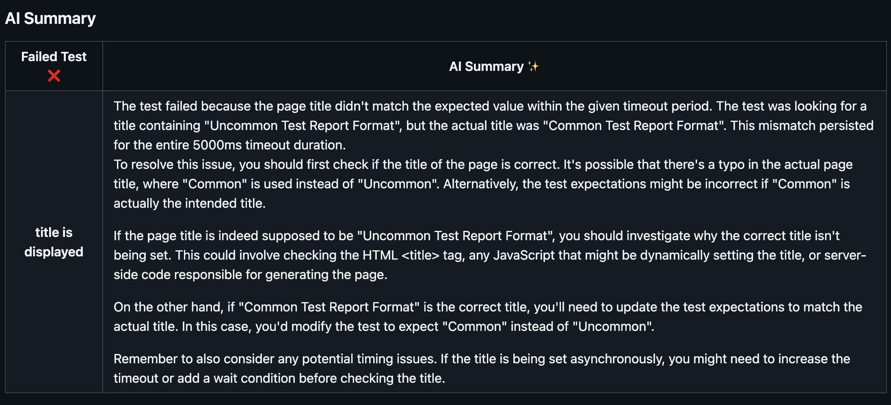

# AI Test Reporter

Enrich your test report with AI error analysis using leading AI models from OpenAI and Anthropic Claude. Integrate with Developer tooling to provide AI summaries where you need them.

## **⭐⭐ If you find this project useful, consider giving it a GitHub star ⭐⭐**

## You can help us grow

Support our mission to enhance test reporting with AI summaries by:

- **⭐ Starring this repository to show your support. ⭐**
- **🙌 Following our [GitHub page here](https://github.com/ctrf-io) 🙌**

Thank you! Your support is invaluable to us! 💙

## Key Features

- Generate a test report with human-readable AI summaries for failed tests
- Use your own AI model, with support for OpenAI, Anthropic Claude and more soon
- Compatible with all major testing frameworks through standardized CTRF reports.
- Integrates AI with various CI/CD and developer tools.
- Customizable parameters like system prompt, model, temperature, max tokens, and more.
- Supports logging the AI generated summaries to the console.

## Usage

Generate a CTRF report using your testing framework. [CTRF reporters](https://github.com/orgs/ctrf-io/repositories) are available for most testing frameworks and easy to install.

**No CTRF reporter? No problem!**

Use [junit-to-ctrf](https://github.com/ctrf-io/junit-to-ctrf) to convert a JUnit report to CTRF

## OpenAI

Run the following command:

```bash
npx ai-ctrf openai <path-to-ctrf-report>
```

An AI summary for each failed test will be added to your test report.

The package interacts with the OpenAI API, you must set `OPENAI_API_KEY` environment variable.

You will be responsible for any charges incurred from using your selected OpenAI model. Make sure you are aware of the associated cost.

### Options

`--model`: OpenAI model to use (default: gpt-3.5-turbo).

`--systemPrompt`: Custom system prompt to guide the AI response.

`--frequencyPenalty`: OpenAI frequency penalty parameter (default: 0).

`--maxTokens`: Maximum number of tokens for the response.

`--presencePenalty`: OpenAI presence penalty parameter (default: 0).

`--temperature`: Sampling temperature (conflicts with topP).

`--topP`: Top-p sampling parameter (conflicts with temperature).

`--log`: Whether to log the AI responses to the console (default: true).

## Claude

Run the following command:

```bash
npx ai-ctrf claude <path-to-ctrf-report>
```

An AI summary for each failed test will be added to your test report.

The package interacts with the Anthropic API, you must set `ANTHROPIC_API_KEY` environment variable.

You will be responsible for any charges incurred from using your selected Claude model. Make sure you are aware of the associated costs.

### Claude Options

`--model`: Claude model to use (default: claude-3-5-sonnet-20240620).

`--systemPrompt`: Custom system prompt to guide the AI response.

`--maxTokens`: Maximum number of tokens for the response.

`--temperature`: Sampling temperature.

`--log`: Whether to log the AI responses to the console (default: true).

## GitHub Actions Integration

View AI summaries in directly in the Github Actions workflow:



## Support Us

If you find this project useful, consider giving it a GitHub star ⭐ It means a lot to us.
